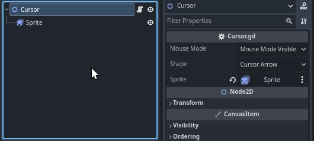

# Awesome Custom Cursor


<!-- Place this tag where you want the button to render. -->
 

## Features

* A ready to use cursor with animation support
* An easy way to change the shape of the cursor


## Use cases

This addon creates an AnimatedSprite2D and makes it follow your mouse. However, this method has a frame of delay, if the precision is not to your liking, you can change the native cursor in the project settings [(check the docs)](https://docs.godotengine.org/en/stable/tutorials/inputs/custom_mouse_cursor.html)

You can mitigate this by disabling the v-sync or limiting the frames.

**You should use this addon** if you want to have an animated cursor since the "hardware" option does not allow animated images.

Also there´s no way for i can see to change the cursor shape in code apart from using a control node.

## Installation

Go to asset tab in your project and search for Awesome Scene Manager and install from there.

You can also get the same files from GodotAssetStore

Or

Go to the release page and grab the latest version, decompress the files in your addons folder (create one if theres none).

## Usage

After installation, it will add an autoload called **Cursor**, this is how you will manage the mouse.

```GDScript
Cursor.mouse_mode = Input.MOUSE_MODE_VISIBLE
Cursor.shape = Cursor.Shapes.CURSOR_POINTING_HAND
```

You would need to change the **mouse_mode** from **Cursor** instead of **Input** to prevent the native cursor overlapping the sprite.

### The Cursor Scene



As you can see the cursor scene is a simple **Node2D** with an **AnimatedSprite2D** called Sprite as his only child.

The scene has two important properties, the same as **Input**; **mouse_mode** and **shape**

### Properties

| Type | Name |
| -------- | -   |
| [Input.MouseMode](https://docs.godotengine.org/en/stable/classes/class_input.html#enum-input-mousemode) | [mouse_mode](#mouse_mode) |
| Cursor.Shapes | [shape](#shape) |

#### mouse_mode

It works the same as Input.mouse_mode except it filters the modes where the cursor should be shown and it displays the sprite instead, to prevent an overlap.

#### shape

This handles a custom Enum called Shapes, this enum is basically [Input.CursorShape](https://docs.godotengine.org/en/stable/classes/class_input.html#enum-input-cursorshape), I recreated it here because these build in Enums cannot be iterated trough.

You can use like so:

```GDScript
Cursor.shape = Cursor.Shapes.CURSOR_BUSY
```

And it gives:


### Sprites and Animations

Taking the name of the shape, it will search for an animation with a similar name, though without the **CURSOR_** and lowercase. Following the previous example;

With a shape of `Cursor.Shapes.CURSOR_BUSY` it will search for an animation called `busy` in the **AnimatedSprite2D**


`Cursor.Shapes.CURSOR_ARROW` becomes simply `arrow`
`Cursor.Shapes.CURSOR_POINTING_HAND` becomes `pointing_hand`
and so on and so forth

You could also use the function `get_shape_name` that returns a StringName of the current name of shape to search for the animation.
